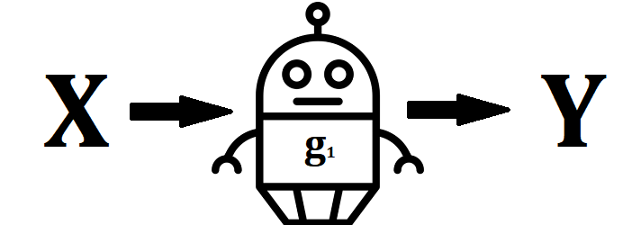
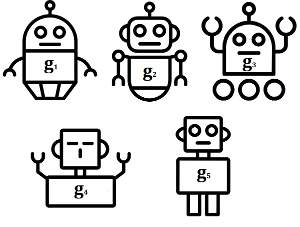
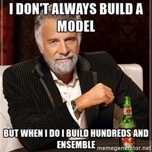
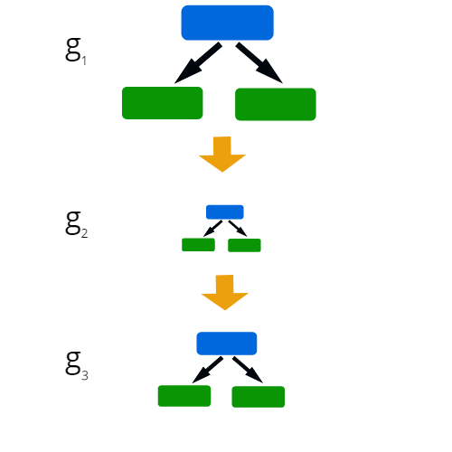
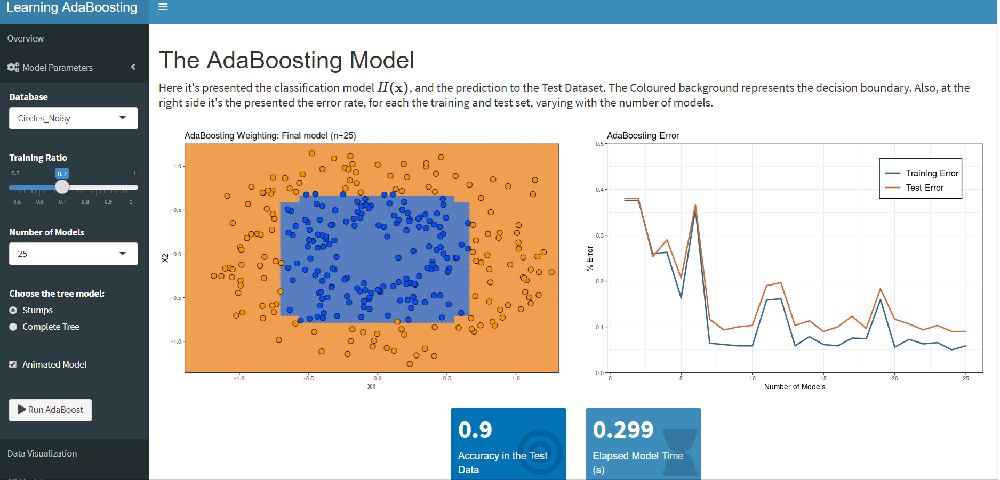
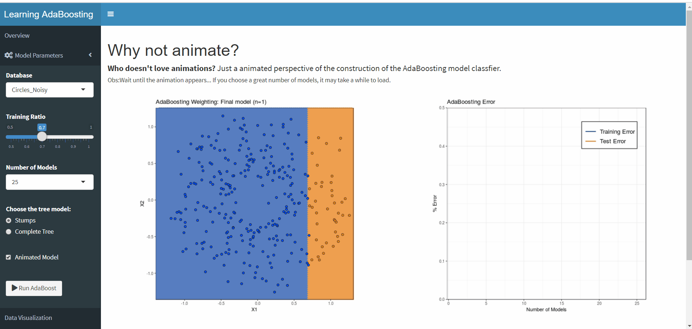
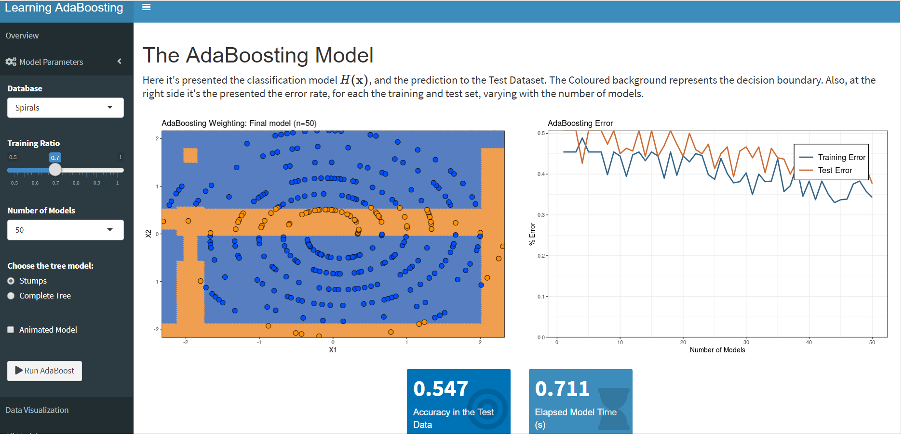
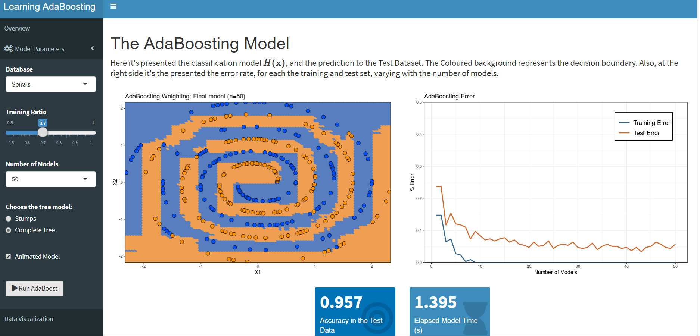

```{r xaringan-themer, include=FALSE}
library(xaringanthemer)
mono_accent(
  base_color = "#33658A",
  header_font_google = google_font("Yanone Kaffeesatz"),
  text_font_google   = google_font("Droid Serif", "300", "300i"),
  code_font_google   = google_font("Droid Mono")
)
```

# Statistical Learning Models

<br/>
<br/>

.center[]


---

class: inverse, center, middle

# Ensemble Models

---

# Ensemble Models


.center[]


---


# Ensemble Models

<br/>
<br/>

.center[]


---

# Boosting Models

.center[]

---

class: inverse, center, middle

# Adaptative Boosting 
## (AdaBoosting)

---

# AdaBoosting

Dado $$\mathbf{y}\in\{1,1\}$$
<br/>
<br/>

$$G(\mathbf{x})=sign \left(\sum_{m=1}^{M} \alpha_{m}g_{m}(\mathbf{x}) \right)$$

--
<br/>
<br/>
##.center[The weighted crowd of experts]


---
# AdaBoosting

<br/>
<br/>

.center[]


---
# AdaBoosting

<br/>
<br/>

.center[]


---
# AdaBoosting Applications

- Optical Character Recognition Task (Drucker, Schapire and Simard ,1993)

--
- Text filtering and classification (Lee, et.al, 2011)

--
- Speech recognition (Saon, 2012)

--
- Object detection (Chen, 2011)

--
- And so on...

---
background-size: cover
class: center, middle, inverse

# ShinyAdaBoosting: The application

---
background-image: url(D:/my_computer/Est_ML_2019/SER_UFF_presentation/shiny_logo.png)
background-size: 100px
background-position: 90% 8%

#Shiny

<br/>
<br/>


###.center["Shiny is an open source R package that provides an elegant and powerful web framework for building web applications using R. (RStudio Team, 2019)"]

---

class: inverse, center, middle

# ShinyAdaBoosting: knowing the application

.center[]

---
# ShinyAdaBoosting: Setting the parameters

-Database

-Training Ratio

-Number of Models

-Type of Tree Model

-Animated Model

-Animate?

---
class: inverse, center, middle

# ShinyAdaBoosting: Vizualizing the Data

.center[]


---
# ShinyAdaBoosting: Final Model
.center[]


---
class: inverse, center, middle

# ShinyAdaBoosting: All Models

.center[]


---
class: inverse, center, middle

# ShinyAdaBoosting: Animated Mode
.center[]

---
# When Stumps aren't enough
.center[]


---

# Complete Trees AdaBoosting
.center[]


---
class: inverse, center, middle

# All Models Complete Trees
.center[]

---
class: inverse, center, middle

# Animate Complete Trees AdaBoost
.center[]

---
# More models?
.center[]


---
## References

-DRUCKER, Harris; SCHAPIRE, Robert; SIMARD, Patrice. __Boosting performance in neural networks.__
In:Advances in Pattern Recognition Systems using Neural Network Technologies. 1993. p. 61-75

-LEE, J. J., LEE, P. H., LEE, S. W., YUILLE, A., & KOCH, C. (2011, September). __Adaboost for text detection in natural scene.__ In 2011 International Conference on Document Analysis and Recognition (pp. 429-434). IEEE.

-SAON, George; SOLTAU, Hagen. __Boosting systems for large vocabulary continuous speech recognition.__ Speech communication, v. 54, n. 2, p. 212-218, 2012.

-CHEN, Shi et al. __Boosting part-sense multi-feature learners toward effective object detection.__ Computer Vision and Image Understanding, v. 115, n. 3, p. 364-374, 2011.

---

##Acknowledgments
<br/>
<br/>
.center[]


---
class: center, middle,inverse

# Thank you!

mateusmaia11@gmail.com

@MateusMaiaM
<br/>
### Explore a little more the ShinyAdaBosting app in

mateusmaia.shinyapps.io/adaboosting/


.footnote[
[1]Slides created via the R package xaringan
]
